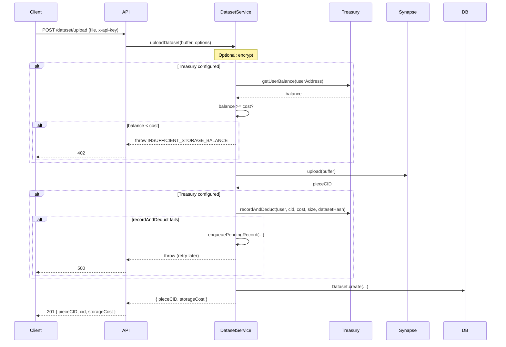
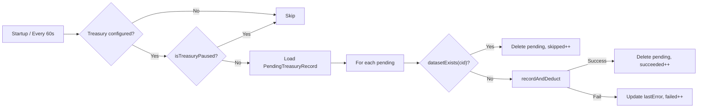
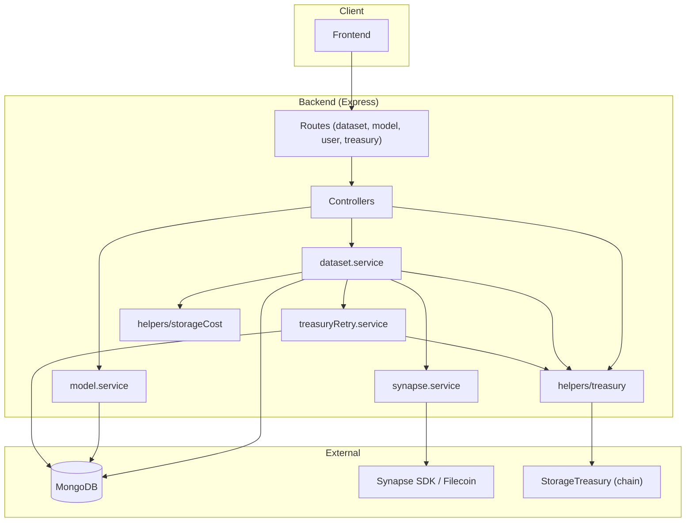

# System Architecture

This document describes the architecture of the Corpus system as implemented in the codebase. The system provides dataset storage on Filecoin (via Synapse), optional onchain treasury-based payment accounting, and model run provenance.

## System Components

### 1. Smart contract (StorageTreasury)

- **Location:** `corpus/contracts/contracts/StorageTreasury.sol`
- **Purpose:** Holds user-deposited ERC20 (e.g. USDFC) for storage payments. Only the designated executor (backend wallet) can call `recordAndDeduct` to deduct a user's balance and record a dataset in one atomic transaction. Users call `deposit` and `withdraw` directly; the contract is Ownable and Pausable.
- **Chain:** Deployed on a configurable chain (e.g. Filecoin Calibration); address and RPC are configured in the backend.

### 2. Backend services

- **Location:** `corpus/backend/src/`
- **Stack:** Node.js, Express, TypeScript, MongoDB.
- **Responsibilities:**
  - **API:** REST routes for user creation, dataset upload/retrieve/list, model run registration, treasury balance and datasets.
  - **Dataset flow:** Optional encryption → balance check (if treasury configured) → Synapse upload → onchain recordAndDeduct (or enqueue on failure) → save metadata to MongoDB.
  - **Treasury integration:** Read balances, call `recordAndDeduct` as executor, check `datasetExists` and `paused` for retry and API responses.
  - **Retry worker:** Process pending treasury records (startup + every 60s) when treasury is configured; skip when paused; remove duplicates via `datasetExists`.

### 3. Database (MongoDB)

- **Connection:** Configured via `MONGODB_URI` in `config/index.ts`; connection in `config/database.ts`.
- **Usage:** Stores API keys and wallet mapping (User), dataset metadata and ownership (Dataset), pending treasury records for retry (PendingTreasuryRecord), and model run provenance (ModelRun). Dataset file content is not stored in MongoDB; it lives on Filecoin via Synapse.

### 4. Filecoin / Synapse storage integration

- **Location:** `corpus/backend/src/services/synapse.service.ts`
- **Library:** `@filoz/synapse-sdk`; network is `calibration` or `mainnet` from `FILECOIN_NETWORK`.
- **Behavior:** Backend uses an operator wallet (`SYNAPSE_OPERATOR_PRIVATE_KEY`) to upload and download. Upload returns a piece CID; that CID is used as the dataset identifier in MongoDB and in the treasury contract. Minimum upload size is 127 bytes (SDK requirement).

### 5. Treasury contract interaction

- **Location:** `corpus/backend/src/helpers/treasury.ts`
- **Behavior:** Backend uses viem to read (`balances`, `datasetExists`, `paused`) and write (`recordAndDeduct`) against the StorageTreasury contract. Write is performed by the executor wallet (`TREASURY_EXECUTOR_PRIVATE_KEY`). Optional startup check: if `TREASURY_EXECUTOR_ADDRESS` is set, it must match the address derived from the executor private key or the server exits.

---

## Data Flow

### Dataset upload

### Treasury balance checks

- Before upload (when treasury is configured): `dataset.service` calls `treasury.getUserBalance(userAddress)`. If balance &lt; fixed storage cost, upload is rejected with 402 and error code `INSUFFICIENT_STORAGE_BALANCE`.
- GET /treasury/balance: Controller calls `treasury.getUserBalance(req.user.walletAddress)` and returns `{ success, balance }` (balance as string).

### Onchain dataset recording

- After a successful Synapse upload, the backend calls `recordAndDeduct(userAddress, cid, costWei, sizeInBytes, datasetHash)`.
- The contract computes `datasetId = keccak256(abi.encodePacked(cid))`, validates CID length (1–96 bytes), checks balance and no existing record, subtracts balance, stores `DatasetRecord` (including `uploadBlock`), and emits `StorageDeducted` and `DatasetStored`.
- `datasetHash` is `keccak256(fileBuffer)` computed in the backend (viem).

### Retry worker reconciliation

- **Startup:** After DB connect, if treasury is configured, `processPendingRecords()` runs once; result is logged (recorded, skipped, failed).
- **Interval:** Every 60 seconds, `processPendingRecords()` runs again. If the contract is paused, the worker does nothing. For each pending record, if `datasetExists(cid)` is true, the pending document is deleted (duplicate protection); otherwise `recordAndDeduct` is called; on success the document is deleted, on failure `lastError` is updated.

---

## Component diagram

All behavior described above is derived from the current implementation in the repository.
