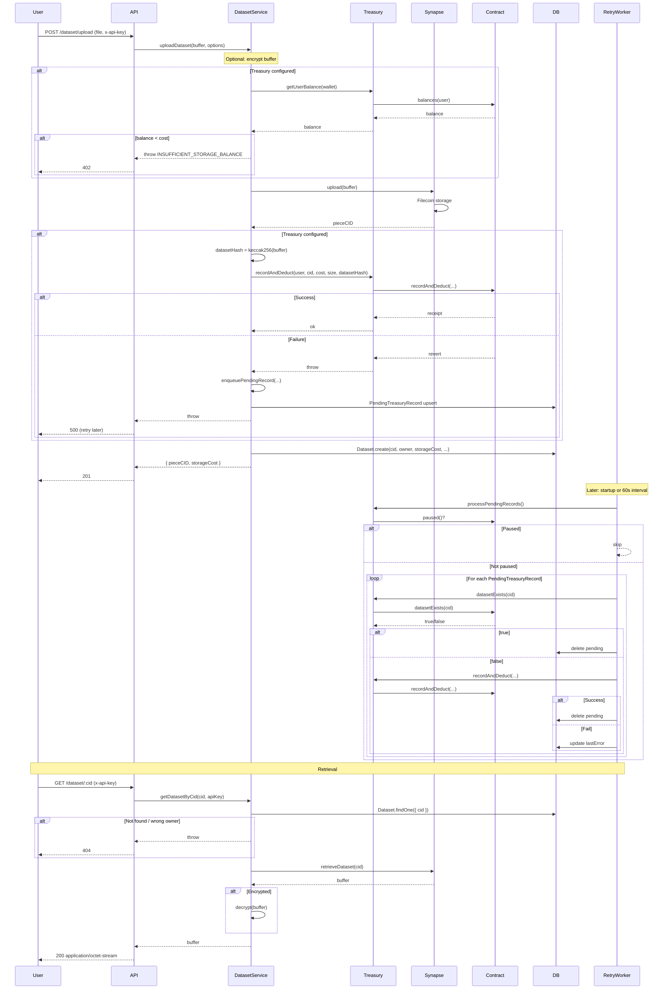

# Dataset Lifecycle

This document describes the full lifecycle of a dataset as implemented in the codebase: from upload request through storage, onchain recording, optional retry, and retrieval.

## Before upload (when treasury is configured)

Storage is **billed per month**; access is **not permanent** (not one payment for permanent access).

1. **User deposits** — The user approves USDFC and calls `deposit(amount)` on the StorageTreasury contract so their on-contract balance is sufficient for uploads and for ongoing per-month cost.
2. **Prepare (optional)** — The client can call **GET /dataset/prepare** to get **debitPerUploadWei** (amount debited per upload) and **debitPerMonthWei** (amount debited per month for storage). Use this to show cost per upload and per month; ensure balance covers at least the per-month cost to retain access.
3. **Upload** — Each successful upload deducts the per-upload amount from the user's treasury balance. Storage is billed per month via debitPerMonthWei; access requires ongoing payment.

## Lifecycle overview

## Named datasets and versions

Datasets can be **named** (e.g. `railway`, `bus`) so that operations are by name instead of CID. Names are **unique per user**: two users can each have a dataset named `railway`; one user cannot have two datasets both named `railway`.

- **New named dataset:** `POST /dataset/upload` with `name` (required for a new name). Creates the first version; it is set as the **default** for that name.
- **Add a new version:** `POST /dataset/by-name/:name/version` with a new file. The new version becomes the default (latest-uploaded is default).
- **List versions:** `GET /dataset/by-name/:name/versions` returns all versions of that named dataset (newest first), each with `cid`, `isDefault`, timestamps, etc.
- **Download by name:** `GET /dataset/by-name/:name` returns the **default** version’s file. Use `?version=<cid>` to download a specific version (must be a version of that name).
- **Set default:** `PUT /dataset/by-name/:name/default` with body `{ "cid": "..." }` sets which version is returned when downloading by name without `?version=`.

Each stored document is one version; multiple documents can share the same `name`. Exactly one version per `(ownerApiKey, name)` has `isDefault: true`. Unnamed uploads (no `name`) and versioning by `previousCID` (POST /dataset/version) continue to work as before.

## Steps in detail

### 1. User upload request

- Client sends `POST /dataset/upload` with multipart field `file` and header `x-api-key`.
- Optional: `name` (unique per user for a new named dataset), `encrypt` (true/false), `previousCID` (for versioning by CID).
- Middleware: `apiKeyAuth` (resolves user from API key), `uploadSingle` (multer, 100 MB limit, memory storage).

### 2. Backend validation and optional encryption

- Controller passes `file.buffer` and options to `uploadDataset`.
- If `encrypt` is true, buffer is encrypted with `ENCRYPTION_SECRET` (AES-256-GCM); the same buffer is then uploaded and hashed for `datasetHash`.

### 3. Treasury balance check (if configured)

- If `treasury.isTreasuryConfigured()`: `getUserBalance(ownerWalletAddress)` is called.
- Cost is fixed: `getStorageCost()` (from `STORAGE_COST_FIXED_WEI`).
- If `balance < cost`, the service throws `INSUFFICIENT_STORAGE_BALANCE`; controller returns 402.

### 4. Synapse storage upload

- `synapse.service.uploadDataset(buffer, ownerWalletAddress)` is called.
- Minimum size 127 bytes is enforced.
- Synapse SDK uploads to Filecoin (calibration or mainnet from config); returns piece CID.
- If upload fails, the function throws; no DB write and no treasury call.

### 5. Onchain dataset recording (if treasury configured)

- `datasetHash = keccak256(buffer)` (viem).
- `treasury.recordAndDeduct(userAddress, pieceCID, costWei, sizeInBytes, datasetHash)` is called.
- Contract computes `datasetId` from `cid`, checks balance and no existing record, deducts balance, stores `DatasetRecord` (including `uploadBlock`), emits events.
- If this call fails (revert or RPC error), `enqueuePendingRecord(...)` is called (upsert by CID into `PendingTreasuryRecord`), then the service throws; controller returns 500 with a message that recording will be retried.

### 6. MongoDB metadata

- After successful upload (and after recordAndDeduct if treasury was used), `Dataset.create(...)` is called with cid (piece CID), ownerApiKey, ownerWalletAddress, optional name, isDefault (true when name is set for a new named dataset), previousCID, encrypted, encryptionType, compressed, compressionFormat, storageCost, uploadTimestamp, etc.
- Response 201 returns `pieceCID`, `cid`, optional `name`, `storageCost`.

### 7. Retry queue if recording failed

- When `recordAndDeduct` failed, the pending record is already in `PendingTreasuryRecord`.
- At startup (after DB connect) and every 60 seconds, `processPendingRecords()` runs when treasury is configured.
- If contract is paused, nothing is done. Otherwise, for each pending: if `datasetExists(cid)` then delete and skip; else call `recordAndDeduct`, delete on success or update `lastError` on failure.
- See [Retry system](retry-system.md) for duplicate protection and behavior.

### 8. Dataset retrieval

- Client sends `GET /dataset/:cid` with `x-api-key` (optional `?metadata=1` for metadata only).
- Service loads `Dataset` by CID and checks `ownerApiKey`. If not found or wrong owner, 404.
- For file: `synapse.service.retrieveDataset(cid)` returns buffer; if `encrypted`, decrypt with config secret; response is `application/octet-stream`.
- For metadata: return cid, ownerWalletAddress, previousCID, encrypted, encryptionType, storageCost, uploadTimestamp, createdAt.

### 9. Deletion

- **Delete one version:** `DELETE /dataset/:cid` — removes the Dataset document for that CID (owner-only). The CID is no longer listed or retrievable via the API; data on Filecoin remains immutable.
- **Delete all versions of a name:** `DELETE /dataset/by-name/:name` — removes all Dataset documents with that `(ownerApiKey, name)`. Returns `deletedCount`. Data on Filecoin is not removed.

All behavior above is taken from the current implementation.
